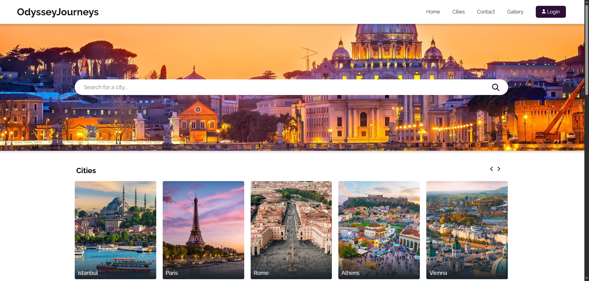
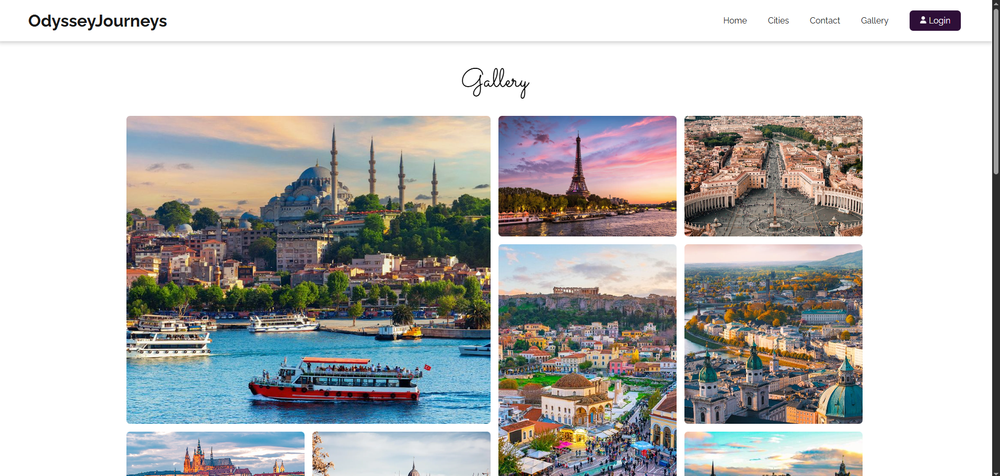
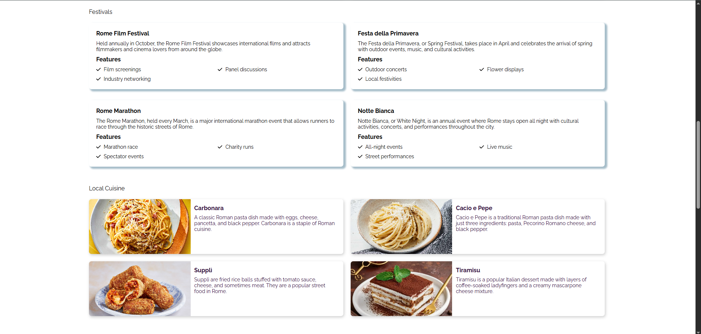

# 🌍 Travel Guide Website

**Travel Guide Website** is a modern, responsive web application where users can explore iconic destinations, discover local tips, view highlights, and get inspired for their next trip. Built with Next.js and SCSS for a fast and user-friendly experience.

🔗 Live Demo
  👉 https://odysseyjourneys.netlify.app
  
## 🖼️ Screenshots





---

## 🚀 Features

- 🗺️ Explore iconic cities across Europe
- 📅 Stay informed about local events & festivals
- 🍽️ Discover local food recommendations
- 💡 Insider travel tips and guides
- 📱 Fully responsive for all screen sizes
- ⚡ Fast and clean UI experience
- 🧪 Uses local fake data (JSON-based)

---

## 🛠️ Built With

- [Next.js](https://nextjs.org/)
- [TypeScript](https://www.typescriptlang.org/)
- [SCSS](https://sass-lang.com/)
- [JavaScript (ES6+)](https://developer.mozilla.org/en-US/docs/Web/JavaScript)
- Fake JSON data (local files for mocking content)

---

## 📦 Getting Started

To run this project locally:

```bash
# Clone the repository
git clone https://github.com/KKocbeler/travel-guide-website.git

# Navigate into the project directory
cd travel-guide-website

# Install dependencies
npm install

# Start the development server
npm run dev
